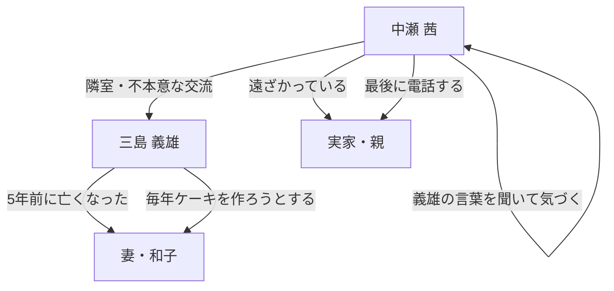

# design_specification.md — 「隣の爺さんのケーキ」

## テーマ

**「頼れないこと」の正体は、傷つくことへの恐れである**

自立を美徳とする時代の中で、「弱さを認める勇気」こそが
人と人をつなぎ、自分を前に進めるという逆説を描く。

---

## コンセプト

- **舞台**: 東京郊外の築古アパート、台所という極めて狭い空間
- **時間軸**: 晩秋のある一夜（数時間の出来事）
- **語り口**: 三人称、茜の視点に寄り添う近距離視点
- **文体**: 余計なものを削ぎ落とした端正な文章。感情の描写は直接的ではなく、行動と感覚を通して滲み出させる。

---

## ストーリー（章ごと）【改訂版 v2 — 書評フィードバック反映】

> **v2の主要変更点（3点）**
> 1. 「頼ることが怖かった」の核心台詞を第2章から第3章へ移動（奇襲の位置を正す）
> 2. 第2章に義雄の「黙る瞬間」を追加（語り部から人間への転換）
> 3. 第4章末尾に感覚的な橋渡しを追加し、最終行への着地を滑らかにする

### 第1章（起）— 「迷惑な隣人」
1. 十一月末の夕暮れ、疲れきって帰宅する茜。一ヶ月間、大学でも誰とも深く関わらないでいる
2. 廊下に座り込む義雄を発見。「大丈夫ですか」が思考より先に出てしまう
3. 断れないまま部屋に入る。焦げた甘い匂い——台所に失敗したケーキの残骸
4. 義雄「女房の誕生日に」とだけ言い、それ以上は語らない。茜も聞かない
5. 材料が残っていることに気づいた茜が、また「思考より先に」申し出る：「もう一回、作りますか」
6. ➡ 章末：茜が自分の部屋のドアを通り過ぎる

### 第2章（承）— 「言えなかったことがあって」
1. 生地を仕込みながら、義雄が和子の話をぽつりぽつりと始める（よく怒っていたこと、笑い方が上手だったこと）
2. 義雄「言えなかったことがあってね」——しかし、そこで止まる。**黙る瞬間**。理由を言わない
3. 茜は聞きたいと思うが、聞けない。かわりに手を動かし続ける（泡だて器の音）
4. 義雄が話題を変えて茜に問いかける：「あなたは、誰かに頼れる人?」
5. 茜「……まあ、そこそこです」と同じ言葉で躱す。義雄は追わない
6. オーブンへ。玄米茶を飲みながら、今年で諦めようとしていたという告白が出る
7. タイマーが鳴る。スポンジが膨らんでいた
8. ➡ 章末：「できましたよ」の一言。声のトーンが少し違う

### 第3章（転）— 「頼ることが怖かった」
1. スポンジを冷ます間、生クリームを泡立てながら茜が切り込む：「さっき、言えなかったことって何ですか」
2. 義雄は少し間を置いてから答える——ここで初めて核心が語られる：「頼ることが、怖かったんだ」
3. 「頼む＝期待する＝裏切られるかもしれない。だから最初から頼らなかった。自立してると思ってたが、逃げてたんだよな」
4. **義雄が再び止まる**。声のトーンが変わり、しばらく窓の外を見る。茜は何も言わない
5. 沈黙の後、義雄「言えなかったことというのは、ありがとう、なんだ。頼ってくれてありがとう、と、頼らせてくれてありがとう。どちらも」
6. 茜の内側で、義雄の論理と自分の論理が重なる——「だったら最初から頼らない方が」は、自分がずっと使ってきた言葉だった
7. ➡ 章末：スポンジに触れると、もう冷めていた

### 第4章（結）— 「不格好なケーキ」
1. 二人でデコレーション。義雄「器用だね」、茜「全然器用じゃないです」「でも、やろうとしてる」
2. 苺ジャムを乗せて完成。歪んで、クリームが足りなくて、それでもケーキだった
3. 義雄「できたよ、和子」——声が小さく、夜の窓に向かって
4. 床に座って二人で食べる。「来年もいるかもしれないです」——茜が初めて未来を口にする
5. 別れ際、義雄はまた「中瀬さん」と呼ぶ。茜は黙って「また」とだけ言う
6. 茜の部屋。静寂。三島の部屋との違い——あそこには不在の人間の気配があった
7. スマートフォンを手に取り、「お母さん」に電話をかける
8. **【新規】感覚の橋渡し**：コール音。繋がった瞬間、受話口から声が来る前に、茜は台所の甘い残り香をまだ肺の中に感じていた
9. ➡ 章末（最終行）：「夜空は、たぶんどこから見ても同じ色をしている」

---

## ストーリー相関図

---

## 感情のアーク【改訂版 v2】

| 章 | 茜の状態 | 義雄の状態 |
|---|---|---|
| 第1章 | 閉じている、義務感で動く | 陽気に見せているが孤独。和子の話を最低限しか言わない |
| 第2章 | 困惑しながら手を動かす。「誰かに頼れるか」と問われ躱す | 言いかけて止まる。語り部ではなく、言えない人間として現れる |
| 第3章 | 義雄の言葉が「自分の論理」と一致していることに気づく | 核心を語る。二度目の沈黙——言葉にするのが一番難しい箇所で止まる |
| 第4章 | 未来を初めて口にする。親に電話をかける | 穏やかな充足。でも再び「中瀬さん」と呼ぶ照れがある |

---

## サスペンスライン（改訂で追加）

読者が引っ張られる「未解決の問い」を各章の末尾に残す。

| 章末 | 読者に残る問い |
|---|---|
| 第1章 | 女房の誕生日——それだけで毎年ケーキを焼く理由は何か |
| 第2章 | 義雄が「言えなかった」のは何か。茜は「頼れるか」という問いを躱したが、本当は？ |
| 第3章 | 「ありがとう」が言えなかった。では茜が言えていないことは何か |
| 第4章 | 繋がった電話の向こうで、茜は何を言ったか（余白） |

---

## 執筆スケジュール（想定）

- 第1章: 約3,000字
- 第2章: 約4,500字（黙る瞬間と問いかけを追加）
- 第3章: 約4,000字（核心の移動・二度目の沈黙）
- 第4章: 約3,500字（感覚の橋渡しを追加）
- **合計目標**: 約15,000字
