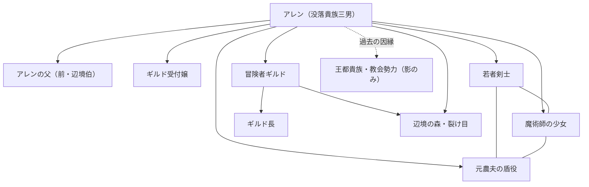

# Monogatari Coach
Monogatari Coach :Novel Generation Support Tool

Monogatari Coachは、小説執筆のすべてを管理し、作品の質を向上させるための包括的な執筆支援ツールです。企画から執筆、推敲、そしてメディアミックス展開（マンガ化など）までをサポートします。

MIT Licenseです。  

## はじめに (Setup)

**1. npmの導入と `rulesync` のインストール**

本プロジェクトでは、AI用のカスタム指示（ルールファイル）を共通化・管理するために `rulesync` を使用しています。
これにより、**Cursor** や **Antigravity** といったエディタだけでなく、**Claude Code**、**Kilo code**、**Cline**、さらには **ChatGPT (Codex CLI)** や **Claude (Claude Code)** といった各種LLM環境に対しても、同一の執筆ルールを自動的に最適化して適用することが可能です。VS CODEおよび互換エディタ上での利用を前提としております。

Node.js (npm) がインストールされている環境で、以下のコマンドを実行して導入してください。

- Node.js  
https://nodejs.org/en/download

- rulesync  
https://github.com/dyoshikawa/rulesync

```bash
npm install -g rulesync
```

これにより、プロジェクト内のルールファイルが同期・共通化されます。

**2. Pythonの導入と `howto_init.py` の実行**

次に、必ず `howto_init.py` を実行してください。
このスクリプトを実行することで、`_how_to.example` から `_how_to` ディレクトリに必要なテンプレートファイル（創作技法ファイルなど）がコピーされ、執筆環境が初期化されます。
※すでにファイルが存在する場合は上書きされません。

Python 3.x がインストールされている環境で、以下のコマンドを実行してください。

- Python 3.x
https://www.python.org/downloads/

```bash
python howto_init.py
```

## 🛠️ ルール同期の管理 (Rule Sync)

プロジェクトのルールやスキルを更新・同期する場合は、以下の手順と注意点を確認してください。

### 基本的な注意点
- **直接 `.cursor/rules/` などの生成ファイルを編集しないでください。** これらは `rulesync` によって自動生成されるため、直接編集しても上書きされて消えてしまいます。
- ルールを更新したい場合は、必ず `.rulesync/` ディレクトリ配下のソースファイルを編集してください。

### 更新の手順
1. 実行により `.rulesync/` 内の該当ファイルを踏襲します：
   - 指示文の追加・修正: `.rulesync/**/*.md`
   - スキルの定義: `.rulesync/skills/*/SKILL.md`
   - MCP設定: `.rulesync/mcp.json`
   - フック設定: `.rulesync/hooks.json`
   - 無視設定: `.rulesync/.aiignore`
2. 以下のコマンドを実行して設定ファイルを再生成します：

```bash
python sync_rules.py
```

これにより、最新のルールがプロジェクト全体に適用されます。

## サポート
現時点では、Cursor、Claude CLI、Kilo code を中心に確認しております。

## 全体構造

Monogatari Coachは以下のディレクトリ構造で管理されています。

- **writers/**: 作家プロフィールを格納（文体、作風など）。
- **novels/**: 作品ごとのディレクトリ。本文や設定資料はここに含まれます。
- **novels/_import/**: 既存作品（他ツール出力・過去原稿など）の**インポート受け口**。ここに置かれたフォルダ／資料を一次情報源として取り込み、必要に応じて `novels/[novel_code]_[novel_title]/` へ展開します（混線防止のため、いきなり `novels/` 直下に置かない運用を推奨）。
- **source_material/**: 原資料（メモ、下書き、プロット等）置き場。存在する場合、まず資料を `novels/` 形式へ展開してから進めます。
- **how_to/**: 創作技法やプロンプトの定義ファイル（ユーザーによるカスタマイズが可能）。
- **_workingspace/**: プロジェクトのログや学習日記。

## モードとワークフロー (Modes)

Monogatari Coachは主に以下のモードで進行します。

0.  **Source Material Intake Mode（資料取り込み／資料展開）**:
    - `source_material/` または `novels/_import/` を一次情報源として、Monogatari Coach形式へ展開します。
    - 原資料を解析し、`proposal.md` / `design_specification.md` / `character.md` / `world.md` / `_novel_text/` / `_novel_text_re/` などを自動生成・整備します。

1.  **Reqruit Mode**:
    - 執筆プロジェクトに必要なメンバー（作家、下読み、読者）をアサインします。
    - `writers/` や `readers/` に新規プロファイルを作成し、文体や評価基準を定義します。

2.  **Plan Mode**:
    - 小説の企画・設計を行います。
    - **Tag Mode**: キャラクタープロフィールから画像生成用タグ（`tag/xxx.md`）を作成します。
    - **Manga Tag Mode**: マンガ構成案から画像生成用プロンプト（YAML形式）を一括出力します。

3.  **Writing Mode**:
    - 実際に執筆を行います。章ごとにファイルを分け、設定資料を参照しながら一貫性のある文章を生成します。

4.  **Meta Management Mode（メタ情報管理）**:
    - 執筆の節目で `_meta.md` を更新し、進捗、伏線、次回のタスク（内部メタ）や、投稿用の紹介文（外部メタ）を管理します。

5.  **Writing Mode Refinement（清書・文章校正）**:
    - `_how_to/rewrite.md` を利用して、初稿の文章をより自然で文学的な表現に磨き上げます。
    - 語彙の変換、主語の調整、文体の統一、官能描写の深化などを行い、読者の没入感を高めます。
    - 校正後のファイルは、各作品ディレクトリ内の `_novel_text/` に出力されます。バックアップは`_novel_text_backup/`に待避します。

6.  **First Reader Mode（下読み・足きり判定）**:
    - `_how_to/reader.md` の基準に従い、商業的な最低基準をクリアしているか（足きりされないか）を厳格に判定します。
    - 判定結果は `_reader/` 配下に詳細な書評ファイルとして保存されます。

7.  **Interest Check Mode（一般読者・興味判定）**:
    - `_how_to/standard_reader.md` とペルソナ（例：田中あかり）を用い、タイトルや冒頭3行での「離脱率」を予測します。
    - 読者の第一印象を重視し、ブラウザバックを防ぐための改善案を提示します。

## 主な機能 (Features)

### 1. 画像生成タグの作成
`tag.md` や `tag/(character_name).md` のルールに基づき、キャラクターやシーンの画像生成用プロンプト（英語タグ）を作成・管理できます。

### 2. マンガ制作 (Manga)
小説本文をもとに、マンガのコマ割り（ネーム作成）を行うことができます。
- 対応ディレクトリ: `novels/[作品名]/manga/`
- ファイル形式: `manga01.md` など、章ごとに作成。

### 3. メタ情報管理 (Meta Management)
執筆の進捗や伏線、外部投稿用のキャッチコピーなどを `_meta.md` で一元管理します。長期連載における文脈の維持をサポートします。

### 4. 高度な評価システム (Evaluation)
商業出版レベルの「下読み」視点と、一般読者の「興味」視点の両面から作品を分析し、具体的な改善案を提示します。

## ⚠️ 重要：新規作成時の注意

**新しい小説を書き始めるときは、必ず 新規に作成することをチャット内に明記してください。**

既存の作品ディレクトリ（例: `novels/001_ExistingNovel/`）の中で新しい別の話を書き始めないでください。設定やコンテキストが混ざり合い、正しく出力できなくなる可能性があります。
必ず `novels/002_NewTitle/` のように、作品ごとにフォルダを明確に分けて運用してください。

## 作例 (Examples)

### 1. 隣の老紳士のケーキ (novels/000_old_man_next_door's_cake)
Claude Code を使用して執筆された短編小説の作例です。
企画書、キャラクター設定、世界観設定から、実際の本文執筆、そして下読み（First Reader）による評価まで、Monogatari Coach の標準的なワークフローを網羅しています。

- [GitHub で作品ディレクトリを見る](https://github.com/kavao/monocri/tree/main/novels/000_old_man_next_door's_cake)
- **内容**: 孤独な青年と、隣に住む不思議な老紳士が「ケーキ」を通じて心を通わせる、温かな日常ファンタジー。
- **活用ポイント**: 
  - `proposal.md`: Claude Code による企画の具体化。
  - `_novel_text/`: 章ごとの分割執筆。
  - `_reader/`: AIによる客観的な書評と改善提案のログ。

## 作業のワークフロー例

基本的に小説の作成を、言葉で指示いたします。
基本的なジャンルや内容を最初にざっくりやり取り、
お試しでAIが書き始めます。それに対して、1番でお願いします、のように選択して、
プロフィールやあらすじを作成していただきます。
世界観なども併せて作成されます。

全て作ることも、逐次来ることも出来る、文章からあらすじレベルに戻す指示も出せるので、
そこは作成順を必ずしも一方的に考える必要はありません。
ただし、大まかな構図から細かい細部の執筆を進める方がうまくいくことは多いです。


- プロットの錬成から
これは一例です
```
小説のプロットを考えたいです。ファンタジー物

(質問を聞かれたときに答えます)
C. なろう系寄りの異世界転移／転生ファンタジー
明るめで冒険寄り（ワクワクと成長）
年代と性別（例：10代後半の少女／30代男性 など）は10代男性、没落貴族の子息、なんとか身一つ。
恋愛要素は薄め。
作品の長さは長編を目指すようなバックボーンは欲しいが、まずは小説一冊分

それでは、設計書に落としてください。

characterから進めてください

world.md をお願いします。

(上記のステップ程度のやり取りだけで小説のあらすじが出来上がります)
```


- 小説執筆のお願い
```
第1章を執筆よろしくお願いします

第4章を4回に分けて執筆したいです。まずは1回目をお願いしたいです

引き続き2回目をお願いします

続きをお願いします
```

- 文章の校正など
抽象的なことなどを解釈することをさせるのでLLMの性能に依存しますが、Gemini3Proレベルであればまず支障ありません。
```
(変更したい領域を選択する [Add to chat]を選ぶ。あるいは該当のテキストに当たる内容を説明する)
この文章のボリュームのニュアンスを深めて2倍にしたい
```

- キャラクタータグ描画のお願い、漫画描画のお願い
```
登場人物のキャラクターのタグを作りたいです。

引き続き漫画のコマ割を第1章をお願いしたいです。
```

- 書評のお願い **First Reader / Interest Check Mode**
```
(Add Directory to Cursor Chat でディレクトリを選択する等)
小説の書評をお願いします
(readerフォルダに 20251210_1200.md のようなファイル名の詳細な書評が出来上がる)
```

## ベータ実験参加募集

Monogatari Coachの実証実験に参加しませんか？ 執筆効率向上のデータを共有いただける方を募集します。

### 参加条件
- Cursorエディタ/Antigravityユーザー/Kilo codeユーザー。
- 創作経験者（小説執筆推奨）。

### 参加方法
- Monogatari Coachのベータ実験を共に！ 執筆支援ツールのフィードバックを共有しましょう。
ものかきAI チャンネルにご加入くださいませ

[🚀 ものかきAI に参加する](https://discord.gg/8Dtffz7X7f)

※規約同意後、#自己紹介からスタートです。


### 特典
- 先行アクセス権。
- クレジット掲載。

## 推奨導入プラグイン

- [Japanese Language Pack for Visual Studio Code](https://open-vsx.org/extension/MS-CEINTL/vscode-language-pack-ja)
日本語は入れましょう  
- [Markdown Preview Mermaid Support](https://open-vsx.org/extension/bierner/markdown-mermaid)
関係性のmermaid図などもでますので推奨します

### (sample) ストーリー相関図（第1巻時点・簡易）



## 謝辞 (Acknowledgments)

このプロジェクトを支えてくださった皆様に感謝申し上げます。

- 参考にしたプロジェクト
Roo Code (Roo Cline)のメモリバンクを応用して最新鋭のAI小説執筆を体験しよう！(20250222)
https://note.com/ashizawakamome/n/nf5527d097287

読者、編集者、作家など簡略化はしましたが、チャットで生成のフローを回すために、コア的な思想は似通っていると思います。

## 祈り
AIに関わる全ての人に、感謝の祈りを!!(神に祈りを捧げるポーズ)


