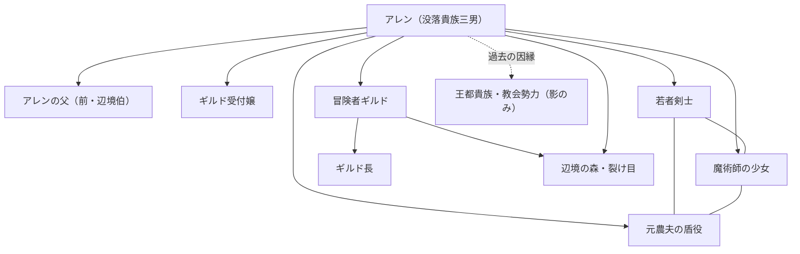

# Monogatari Creator
Monogatari Creator :Novel Generation Support Tool

Monogatari Creatorは、小説執筆のすべてを管理し、作品の質を向上させるための包括的な執筆支援ツールです。企画から執筆、推敲、そしてメディアミックス展開（マンガ化など）までをサポートします。

## はじめに (Setup)

**最初に必ず `init.bat` を実行してください。**

このバッチファイルを実行することで、`_how_to.example` から `_how_to` ディレクトリに必要なテンプレートファイル（創作技法ファイルなど）がコピーされ、執筆環境が初期化されます。
※すでにファイルが存在する場合は上書きされません。

## サポート
現時点では、Cursorと、Antigravity に対応しております。


## 全体構造

Monogatari Creatorは以下のディレクトリ構造で管理されています。

- **writers/**: 作家プロフィールを格納（文体、作風など）。
- **novels/**: 作品ごとのディレクトリ。本文や設定資料はここに含まれます。
- **how_to/**: 創作技法やプロンプトの定義ファイル（ユーザーによるカスタマイズが可能）。
- **_workingspace/**: プロジェクトのログや学習日記。

## モードとワークフロー (Modes)

Monogatari Creatorは主に以下のモードで進行します。

1.  **Reqruit Mode**:
    - 執筆プロジェクトに必要なメンバー（作家）をアサインします。(しなくても進みます)
    - 必要に応じて `writers/`に新規プロファイルを作成します。

2.  **Plan Mode**:
    - 小説の企画・設計を行います。
    - `proposal.md`（企画書）、`design_specification.md`（設計書）、`character.md`（キャラ設定）、`world.md`（世界観）などのファイルを作成・整備します。

3.  **Writing Mode**:
    - 実際に執筆を行います。
    - `_novel_text/` 内に `novel_text01.md` のように章ごとにファイルを分けて執筆します。

4.  **Reading Mode**:
    - 書かれた原稿を下読み・レビューします。
    - `_how_to/reader.md` の基準に従い、客観的な評価を行います。

## 主な機能 (Features)

### 1. 画像生成タグの作成
`tag.md` や `tag/(character_name).md` のルールに基づき、キャラクターやシーンの画像生成用プロンプト（英語タグ）を作成・管理できます。

### 2. マンガ制作 (Manga)
小説本文をもとに、マンガのコマ割り（ネーム作成）を行うことができます。
- 対応ディレクトリ: `novels/[作品名]/manga/`
- ファイル形式: `manga01.md` など、章ごとに作成。

## ⚠️ 重要：新規作成時の注意

**新しい小説を書き始めるときは、必ず 新規に作成することをチャット内に明記してください。**

既存の作品ディレクトリ（例: `novels/001_ExistingNovel/`）の中で新しい別の話を書き始めないでください。設定やコンテキストが混ざり合い、正しく出力できなくなる可能性があります。
必ず `novels/002_NewTitle/` のように、作品ごとにフォルダを明確に分けて運用してください。

## 作業のワークフロー例

基本的に小説の作成を、言葉で指示いたします。
基本的なジャンルや内容を最初にざっくりやり取り、
お試しでAIが書き始めます。それに対して、1番でお願いします、のように選択して、
プロフィールやあらすじを作成していただきます。
世界観なども併せて作成されます。

全て作ることも、逐次来ることも出来る、文章からあらすじレベルに戻す指示も出せるので、
そこは作成順を必ずしも一方的に考える必要はありません。
ただし、大まかな構図から細かい細部の執筆を進める方がうまくいくことは多いです。


- プロットの錬成から
これは一例です
```
小説のプロットを考えたいです。ファンタジー物

(質問を聞かれたときに答えます)
C. なろう系寄りの異世界転移／転生ファンタジー
明るめで冒険寄り（ワクワクと成長）
年代と性別（例：10代後半の少女／30代男性 など）は10代男性、没落貴族の子息、なんとか身一つ。
恋愛要素は薄め。
作品の長さは長編を目指すようなバックボーンは欲しいが、まずは小説一冊分

それでは、設計書に落としてください。

characterから進めてください

world.md をお願いします。

(上記のステップ程度のやり取りだけで小説のあらすじが出来上がります)
```


- 小説執筆のお願い
```
第1章を執筆よろしくお願いします

第4章を4回に分けて執筆したいです。まずは1回目をお願いしたいです

引き続き2回目をお願いします

続きをお願いします
```

- 文章の校正など
抽象的なことなどを解釈することをさせるのでLLMの性能に依存しますが、Gemini3Proレベルであればまず支障ありません。
```
(変更したい領域を選択する [Add to chat]を選ぶ。あるいは該当のテキストに当たる内容を説明する)
この文章のボリュームのニュアンスを深めて2倍にしたい
```

- キャラクタータグ描画のお願い、漫画描画のお願い
```
登場人物のキャラクターのタグを作りたいです。

引き続き漫画のコマ割を第1章をお願いしたいです。
```

- 書評のお願い **Reading Mode**
```
(Add Directory to Cursor Chat でディレクトリを選択する等)
小説の書評をお願いします
(readerフォルダに reader_20251210_1200.md のようなファイル名の書評が出来上がる)
```

## ベータ実験参加募集

Monogatari Creatorの実証実験に参加しませんか？ 執筆効率向上のデータを共有いただける方を募集します。

### 参加条件
- Cursorエディタ/Antigravityユーザー。
- 創作経験者（小説執筆推奨）。

### 参加方法
- Monogatari Creatorのベータ実験を共に！ 執筆支援ツールのフィードバックを共有しましょう。
ものかき＆えーあい チャンネルにご加入くださいませ

[🚀 ものかき＆えーあい に参加する](https://discord.gg/8Dtffz7X7f)

※規約同意後、#自己紹介からスタートです。


### 特典
- 先行アクセス権。
- クレジット掲載。

## 推奨導入プラグイン

- [Japanese Language Pack for Visual Studio Code](https://open-vsx.org/extension/MS-CEINTL/vscode-language-pack-ja)
日本語は入れましょう  
- [Markdown Preview Mermaid Support](https://open-vsx.org/extension/bierner/markdown-mermaid)
関係性のmermaid図などもでますので推奨します

### (sample) ストーリー相関図（第1巻時点・簡易）



## 謝辞 (Acknowledgments)

このプロジェクトを支えてくださった皆様に感謝申し上げます。

- おえかき＆えーあい discord channnelの皆様に感謝を！ 
- 参考にしたプロジェクト

読者、編集者、作家など簡略化はしましたが、チャットで生成のフローを回すために、コア的な思想は似通っていると思います。

## 祈り
AIに関わる全ての人に、感謝の祈りを!!(神に祈りを捧げるポーズ)


